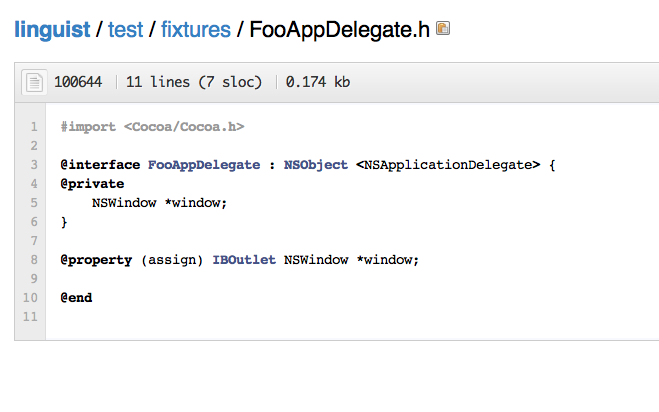
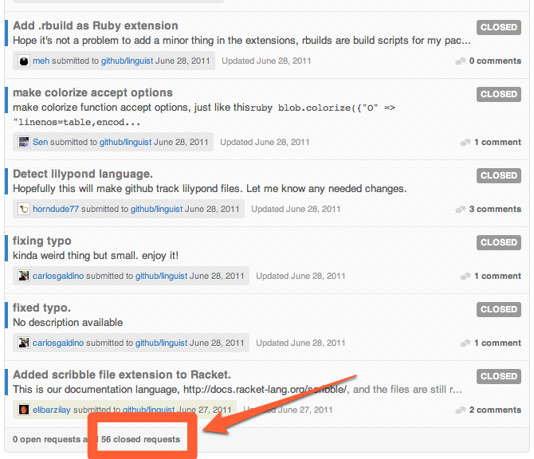

!SLIDE subsection
# open sourcing your code #

!SLIDE
# if it does not exist, and it is general, OS it #

!SLIDE
# improve the software commodity ecosystem #

!SLIDE
.notes like electricity or copper
# commodity #

!SLIDE
.notes it is basically the same no matter who produces it - no adv making yourself
# fungible #

!SLIDE
# gas, not cars #

!SLIDE center

!SLIDE center

!SLIDE
# when everyone is milking their own cow #

!SLIDE
# nobody wins #

!SLIDE
# efficiency #

!SLIDE

# software as milk #

!SLIDE supersection
# advantages #

!SLIDE
# you know it will be public, so you write cleaner #

!SLIDE bullets incremental
# developers create ties in the community #

* network to ask questions / learn from
* cross pollination
* recruit from

!SLIDE
# get free work #

!SLIDE 
# GitHub examples #

!SLIDE bullets incremental
# GitHub OS Projects #

* grit
* bert / ernie
* resque
* proxymachine
* cijoe

!SLIDE
# have customers add features #

!SLIDE bullets incremental
## parts of GitHub open-outsourced ##

* linguist
* github-services
* jekyll
* markup
* albino
* progit

!SLIDE
# have customers add features #

!SLIDE 
# github-services #
### github.com/github/github-services ###

!SLIDE center

!SLIDE 
# linguist #
### github.com/github/linguist ###

!SLIDE center

!SLIDE center

!SLIDE center
# 56 Pull Requests in 2 months #

!SLIDE
# contributions #

!SLIDE 
# github-services #
### github.com/github/github-services ###

     

    @@@ Ruby 
          @stats = { 
                :commits =>  120, 
                :lines   => 2554, 
                :authors =>   52, 
                :percent =>   36%
          }

!SLIDE
# grit #
### github.com/mojombo/grit ###

     

    @@@ Ruby 
          @stats = { 
                :commits =>   70, 
                :lines   => 1564, 
                :authors =>   21, 
                :percent =>   21%
          }

!SLIDE
# jekyll #
### github.com/mojombo/jekyll ###

     

    @@@ Ruby 
          @stats = { 
                :commits =>  273, 
                :lines   => 3367, 
                :authors =>   59, 
                :percent =>   52%
          }

!SLIDE
# resque #
### github.com/defunkt/resque ###

     

    @@@ Ruby 
          @stats = { 
                :commits =>  127, 
                :lines   => 3273, 
                :authors =>   46, 
                :percent =>   18%
          }

!SLIDE
# total #

     

    @@@ Ruby 
          @total_stats = { 
                :commits =>   590, 
                :lines   => 10758,
                :authors =>   178, 
          }

